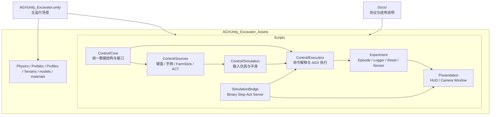
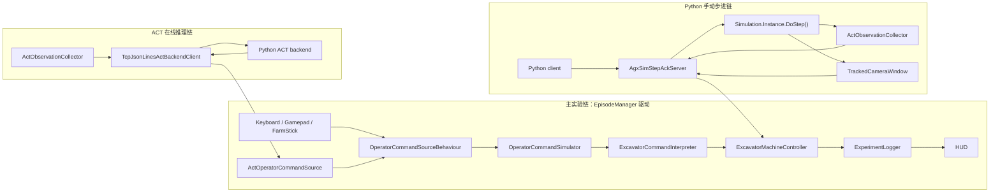

# AGXUnity Excavator Current Project Structure

更新时间：2026-03-26

## 1. 文档目的

这份文档描述的是 `AGXUnity_Excavator` 当前已经落地的项目结构，而不是早期设计草稿。

它回答三个问题：

- 代码现在按什么目录和模块组织
- 主场景里真实在运行的两条控制链路是什么
- 哪些文档应当被视为“现状真值源”

## 2. 适用范围与真值源

当前活跃集成目标是：

- `AGXUnity_Excavator.unity`

当前不作为主线说明对象的是：

- `AGXUnity_Excavator_measurements.unity`

与当前实现最接近的真值源是：

- `Docs/protocol.md`
- `AGXUnity_Excavator_Assets/Scripts/...`
- `AGXUnity_Excavator.unity`

需要特别说明：

- `Docs/excavator_act_software_structure.md` 更偏设计稿和演进思路，不应再被当成当前实现的精确结构说明。
- 本文档优先描述“现在代码里有什么、是怎么连起来的”。

## 2.1 当前 V0 任务边界

当前主线 MVP 不是“可驾驶挖机全任务”，而是：

- 固定站位 / 固定初始姿态的 digging 任务
- step-ack action space 只包含 4D 臂控：
  `swing / boom / stick / bucket`
- `drive / steer / track` 暂时不进入 Repo A <-> Repo B 的 step-ack 契约

这意味着：

- Repo A 当前通过二进制 step-ack 录制的 HDF5 数据集，是站位固定的挖掘演示数据
- 履带移动如果需要，属于回合外人工 reposition，或未来 V1 再扩 action space
- Unity `STEP_RESP.reward` 当前镜像
  `deposited_mass_in_target_box_kg`，作为 backup success proxy；Repo A /
  testbed 仍然基于导出的 `env_state` 本地计算主 excavation mission reward
- 当前 step-ack `env_state` 顺序是：
  `[mass_in_bucket_kg, excavated_mass_kg, mass_in_target_box_kg, deposited_mass_in_target_box_kg, min_distance_to_target_m, target_hard_collision_count, target_contact_max_normal_force_n, min_distance_to_dig_area_m, bucket_depth_below_dig_area_plane_m]`
- `mass_in_target_box_kg` 当前表示“运行时选中的接料目标”
  当前主场景支持 `ContainerBox` 和 `TruckBed`
- `min_distance_to_target_m` 当前表示 bucket target-distance proxy 到当前激活目标 distance geometry 的近似最小距离
- `target_hard_collision_count` / `target_contact_max_normal_force_n` 当前表示
  excavator 与当前激活目标硬表面的每步硬碰撞摘要信号
- `min_distance_to_dig_area_m` / `bucket_depth_below_dig_area_plane_m` 当前表示
  bucket 量测体相对场景 `DigArea` 的起挖几何信号
- 当当前激活目标是 `TruckBed` 时，硬碰撞监控范围覆盖整台 `BedTruck`，而不只是 bed / trunk 量测区域
- 当前默认 evaluator / mission success 使用
  `deposited_mass_in_target_box_kg` 作为最终成功信号，默认阈值为
  `100 kg` 且需保持 `25` 个 control step

## 2.2 当前联调 / 运行命令

Repo A 当前主线命令是：

```bash
conda activate aloha
python scripts/agx_smoke.py --host 127.0.0.1 --port 5057 --steps 500 --strict
tb-record-teleop --config testbed/configs/teleop_v0.yaml --input joystick --num-episodes 5
tb-replay --episode data/agx_teleop/episode_0.hdf5 --config testbed/configs/teleop_v0.yaml --save-video
tb-train --config testbed/configs/act_agx_v0.yaml
tb-eval --config testbed/configs/eval_agx_v0.yaml
```

命令边界：

- `tb-record-teleop` / `tb-replay` / `tb-eval` 都需要 Unity 主场景运行并监听
  step-ack 端口
- `tb-train` 是离线训练，不需要 Unity 在线
- 最终 canonical dataset 由 Repo A 直接写 HDF5
- 当前主场景不再挂 Unity 本地 `metadata.json` / `steps.jsonl` / raw RGB sidecar exporter

## 3. 顶层目录

```text
AGXUnity_Excavator/
  AGXUnity_Excavator.unity
  AGXUnity_Excavator_measurements.unity
  AGXUnity_Excavator_Assets/
    Physics/
    Prefabs/
    Profiles/
    Scripts/
      Control/
      Experiment/
      Presentation/
      SimulationBridge/
      Editor/
    Terrains/
    materials/
    models/
  Docs/
  README.md
```

这里真正承载当前控制与实验逻辑的是：

- `AGXUnity_Excavator.unity`
- `AGXUnity_Excavator_Assets/Scripts/`
- `Docs/`

### 3.1 整体结构图

下面这张图描述的是当前项目的高层组织关系：



这张图对应的是“目录和模块如何拼起来”，不是运行时逐帧调用顺序。

## 4. Scripts 目录结构

### 4.1 `Control/Core`

这一层放统一的数据结构和抽象接口，是所有输入源和执行层共享的基础。

当前关键文件：

- `OperatorCommand.cs`
  统一的人类操作命令结构
- `IOperatorCommandSource.cs`
  输入源接口
- `OperatorCommandSourceBehaviour.cs`
  Unity 组件化输入源基类
- `ExcavatorActuationCommand.cs`
  挖机执行命令结构
- `ExcavatorRigLocator.cs`
  当前 rig 上组件解析辅助

### 4.2 `Control/Sources`

这一层负责“命令从哪里来”。

当前已经存在的来源包括：

- `KeyboardOperatorCommandSource.cs`
- `GamepadOperatorCommandSource.cs`
- `FarmStickOperatorCommandSource.cs`
- `ActOperatorCommandSource.cs`

同时这里也放了 ACT 相关协议和客户端组件：

- `ActBackendClientBehaviour.cs`
- `TcpJsonLinesActBackendClient.cs`
- `ActProtocol.cs`
- `ActObservationCollector.cs`

职责边界是：

- 输入源负责读取设备或后端结果
- 输出统一 `OperatorCommand`
- 不直接控制 AGX 约束

### 4.3 `Control/Simulation`

这一层负责把原始输入变成更平滑、更接近真实操作行为的控制量。

当前文件：

- `OperatorCommandSimulator.cs`
- `AxisResponseProfile.cs`

它位于输入源和机器解释层之间。

### 4.4 `Control/Execution`

这一层负责把 `OperatorCommand` 变成真正的挖机执行量，并写入 AGX 约束控制器。

当前关键文件：

- `ExcavatorCommandInterpreter.cs`
- `ExcavatorMachineController.cs`
- `ExcavatorActuationLimits.cs`

职责划分是：

- `Interpreter` 负责语义映射
- `MachineController` 负责实际执行和限幅
- `ActuationLimits` 提供加速度等约束参数

### 4.5 `Experiment`

这一层负责实验生命周期、日志和数据导出。

当前文件：

- `EpisodeManager.cs`
- `SceneResetService.cs`
- `ExperimentLogger.cs`
- `TerrainParticleBoxMassSensor.cs`
- `TruckBedMassSensor.cs`
- `SwitchableTargetMassSensor.cs`
- `TargetMassSensorBase.cs`
- `BucketTargetDistanceMeasurementUtility.cs`

补充说明：

- 历史上存在过 Unity 本地 sidecar 导出路径
- 但相关 `TeleopEpisodeExporter` 脚本和主场景挂载都已从当前主线移除，因此不再作为当前主线输出路径说明对象

职责划分：

- `EpisodeManager`
  负责回合开始、结束、重置、输入源切换，以及主控制链驱动
- `SceneResetService`
  负责场景重置；当前会对全场景刚体与约束做快照/恢复，所以 `BedTruck` 的车体姿态和 bed 相关约束状态也会随 reset 一起回到初始基线
- `ExperimentLogger`
  负责导出逐帧 CSV 日志
- `TerrainParticleBoxMassSensor`
  负责把场景里的目标箱体/接料面当成“接料质量传感区域”，统计当前箱内质量与 reset 以来的净沉积质量，来源同时包含 terrain soil particles 和 `HandleAsParticle` 动态刚体（例如 `Dynamic Rock`）
- `TruckBedMassSensor`
  负责把 `BedTruck` 的 `Bed` / trunk 区域当成接料质量传感区域，优先按 `Bed` 子树中的 AGX `Box` 碰撞几何合成局部包围盒并加顶部余量，统计当前质量和 reset 以来的净沉积质量；统计时会聚合所有活跃 `DeformableTerrain`，避免 truck bed support terrain 让粒子质量漏计
- `SwitchableTargetMassSensor`
  负责在多个目标传感器之间做运行时切换，并把当前激活目标统一暴露给 `EpisodeManager`、`ActObservationCollector`、HUD 和 reset 链路

### 4.5.1 当前质量统计支线

当前主场景里，和“目标箱体 / 接料目标质量统计”相关的实现已经明确分成两类：场景目标箱体统计，以及 truck bed 统计。

#### A. `SubmergedBox` 目标箱体统计

主场景中的 `SubmergedBox` 当前挂载的是 `TerrainParticleBoxMassSensor`。

它的场景结构约束是：

- `SubmergedBox` 根节点保留一个 AGX `Box`，作为传感器 footprint / 底板
- `SubmergedBox` 的四个墙体子物体分别挂各自的 AGX `Box`
- 这四个墙体 `Box` 作为静态几何体参与 AGX 碰撞

它的统计方式是：

- 直接遍历场景中所有活跃 `DeformableTerrainBase` 的当前 soil particles
- 这里包含 truck bed 使用的 `MovableTerrain`
- 同时遍历场景里 `HandleAsParticle = true` 且当前仍为 `DYNAMICS` 的刚体，例如 `Dynamic Rock`
- 只对位于 `SubmergedBox` 上方定向盒体测量体积内的对象累加质量

因此，`SubmergedBox` 当前统计到的是两部分质量之和：

- 测量体积内的 terrain soil particle 质量
- 测量体积内、被当成粒子处理的动态刚体质量

#### B. `TruckBedMassSensor` 统计

`TruckBedMassSensor` 的目标是稳定统计 `BedTruck` 接料区域内的质量，并避免 truck 自带 terrain/碰撞结构导致漏计。

当前行为是：

- 在 AGX 初始化前，临时禁用 truck 的 `BedTerrain` 子物体
- 重新启用 `Bed` 现有的支撑 `Box` 碰撞
- 优先使用这些 `Box` 碰撞几何，再加顶部 headroom，构造 truck 的测量体积
- 以本次 reset 时测得的质量作为基线，输出 truck target 当前质量和净沉积质量

这样做的直接目的，是避免以下几类问题：

- truck 的 `MovableTerrain` merge 成高度场后漏计
- 底板穿透导致统计不稳定
- 只统计到床斗底部一层质量

#### C. reset 后的质量行为

在执行 `SceneResetService.ResetScene(resetTerrain: true, ...)` 之后：

- terrain native 层会清掉动态粒子
- 各质量传感器的当前计数会同步归零
- truck target 的净沉积质量基线也会按本次 reset 重新建立

#### D. 当前数据出口

这条质量统计数据当前已经进入以下几个出口：

- `ExperimentHUD`
- `ExperimentLogger`
- `ActObservation.task_state.*`

当前二进制 `STEP_RESP.env_state` 的顺序是：

`[mass_in_bucket_kg, excavated_mass_kg, mass_in_target_box_kg, deposited_mass_in_target_box_kg, min_distance_to_target_m, target_hard_collision_count, target_contact_max_normal_force_n, min_distance_to_dig_area_m, bucket_depth_below_dig_area_plane_m]`

其中：

- `mass_in_target_box_kg` 表示当前激活接料目标内的实时质量
- `deposited_mass_in_target_box_kg` 表示相对本次 reset 基线的净沉积质量
- `min_distance_to_target_m` 表示 bucket target-distance proxy 到当前激活目标 distance geometry 的近似最小距离；不可计算时为 `-1`
- `target_hard_collision_count` 表示当前 episode 内累计的监控 excavator-vs-active-target 硬碰撞次数
- 同一段连续接触期间，这个累计值最多只增加一次；必须先离开目标，下一次接触才会再次增加
- `target_contact_max_normal_force_n` 表示当前这一步中，监控 excavator-vs-active-target 接触的最大法向力
- `min_distance_to_dig_area_m` 表示 bucket 量测体到场景 `DigArea` 薄 box 的近似最小距离；不可计算时为 `-1`
- `bucket_depth_below_dig_area_plane_m` 表示当前 bucket 量测体最低点低于 DigArea 平面的深度；未低于平面时为 `0`
- `min_distance_to_target_m` 在 bucket 侧现在优先使用 `ExcavationMassTracker` 上单独配置的 target-distance proxy volume；DigArea 两个几何字段仍继续复用 bucket 质量统计那套 measurement frame / volume

#### E. `ExcavationMassTracker` 的 bucket 统计补充

`ExcavationMassTracker` 当前不再只依赖 `terrain.getDynamicMass(shovel)`。

当前 bucket 质量统计分成两部分：

- bucket 内 terrain 对 shovel 的动态质量统计仍然保留
- 同时会在 bucket 的局部测量体积内，额外统计 `HandleAsParticle` 的动态刚体质量

这意味着：

- `MassInBucket`
- `ExcavatedMass`

现在都可以覆盖 `Dynamic Rock` 这类“以刚体形式存在、但按粒子语义处理”的动态石块。

### 4.6 `Presentation`

这一层负责调试和可视化。

当前文件：

- `ExperimentHUD.cs`
- `TrackedCameraWindow.cs`

职责：

- `ExperimentHUD` 展示运行时状态、输入源、ACT 状态、step-ack 状态和质量统计
- HUD 现在同时展示当前激活的接料目标，并支持通过 `F8/F9` 在不同 target 间切换
- `TrackedCameraWindow` 提供场景内相机窗口、原始 RGB 抓帧能力，以及 Inspector
  中的默认旋转偏移微调（`m_localRotationOffsetEuler`）
- `TrackedCameraWindow` 的 FPV 抓帧走相机到 `RenderTexture` 的路径，不会把
  `ExperimentHUD` 或窗口装饰条叠进 step-ack 导出的 `fpv` 图像

### 4.7 `SimulationBridge`

这一层负责 Unity 与 Python 之间的二进制 step-ack 仿真桥。

当前文件：

- `AgxSimProtocol.cs`
- `AgxSimStepAckServer.cs`

职责：

- `AgxSimProtocol` 定义消息类型、常量和二进制 framing/CRC 语义
- `AgxSimStepAckServer` 对外提供 `GET_INFO / RESET / STEP` 服务，并在手动步进模式下调用 `Simulation.Instance.DoStep()`

## 5. 当前两条主运行链路

### 5.0 运行链路总图

下面这张图描述的是主场景里当前最重要的两条运行链路，以及它们之间的边界：



这张图强调的是：

- ACT 链最终仍然回到 `OperatorCommand` 主控制链
- step-ack 链直接驱动 `DoStep()`，不经过 `TcpJsonLinesActBackendClient`
- 两条链都能和 Python 通信，但职责不同

### 5.1 实验/交互控制链

这是主场景中 `EpisodeManager` 驱动的标准实验链。

```text
OperatorCommandSourceBehaviour
  -> OperatorCommandSimulator
  -> ExcavatorCommandInterpreter
  -> ExcavatorMachineController
  -> ExperimentLogger
  -> ExperimentHUD
```

这条链支持：

- 键盘输入
- 手柄输入
- FarmStick 输入
- ACT 后端返回的 `OperatorCommand`

`EpisodeManager` 在 `Update()` 中完成如下工作：

1. 读取当前输入源的 `OperatorCommand`
2. 处理开始、停止、重置请求
3. 通过 `OperatorCommandSimulator` 做输入仿真
4. 通过 `ExcavatorCommandInterpreter` 转成执行命令
5. 通过 `ExcavatorMachineController` 应用到 AGX 挖机
6. 在回合运行时记录 CSV 日志

### 5.2 ACT 在线推理链

ACT 并不是直接替代 AGX 执行器，而是作为一种 `OperatorCommand` 来源插入到上面的主控制链中。

```text
ActObservationCollector
  -> TcpJsonLinesActBackendClient
  -> ActOperatorCommandSource
  -> EpisodeManager 主链
```

当前行为是：

- `ActObservationCollector` 从场景采集 ACT 观测
- `TcpJsonLinesActBackendClient` 用 TCP JSON Lines 与 Python ACT backend 通信
- `TcpJsonLinesActBackendClient` 会检测后端断线，并在同一 `host:port` 上持续重连
- 若重连时 episode 仍在运行，client 会自动重发 `hello` 和当前 episode 的 `reset`
- backend 离线期间不会无限堆积旧 observation，而是只保留最新一条待发送 `step`
- `ActOperatorCommandSource` 管理 episode、`session_id`、`seq`、超时回零、非法响应过滤
- 产出的仍然是统一 `OperatorCommand`

所以 ACT 链是“决策输入源”，不是“外部手动步进器”。

### 5.3 Python 手动步进链

这是与 ACT 链平行的另一条接口，目标是让 Python 显式驱动 Unity 仿真一步一步前进。

```text
Python client
  -> AgxSimStepAckServer
  -> ApplyActuationCommand
  -> Simulation.Instance.DoStep()
  -> ActObservationCollector / TrackedCameraWindow
  -> STEP_RESP
```

当前这条链的关键特征：

- 使用二进制协议，不走 JSON Lines ACT 接口
- `RESET` 和 `STEP` 前会确保 `Simulation.AutoSteppingMode = Disabled`
- `STEP_REQ` 会应用 4 维 action，然后调用一次 `DoStep()`
- `STEP_RESP` 返回 4D `qpos`、4D `qvel`、`env_state`、`reward`、`sim_time_ns` 和 FPV 原始图像
- `env_state` 现在保持前 7 个字段兼容，并在尾部追加 DigArea good-start 信号
- server 在 serving 时可以暂时禁用 `EpisodeManager`，避免常规实验链和手动步进同时驱动仿真

## 6. 主场景中的当前集成角色

`AGXUnity_Excavator.unity` 中当前主实验 rig 名称是：

- `ExcavatorExperimentRig`

这个 rig 当前承载的核心组件包括：

- `EpisodeManager`
- `OperatorCommandSimulator`
- `ExcavatorMachineController`
- `ExperimentLogger`
- `ExperimentHUD`
- `ActObservationCollector`
- `ActOperatorCommandSource`
- `TcpJsonLinesActBackendClient`
- `AgxSimStepAckServer`
- `TerrainParticleBoxMassSensor`（场景中的 `SubmergedBox` 挂载）

可以把它理解成一个“实验控制中枢”：

- 交互式实验走 `EpisodeManager`
- ACT 在线推理也接在 `EpisodeManager` 上
- Python 手动步进走 `AgxSimStepAckServer`

## 7. 当前数据输出

当前项目主线有一类主要输出，另有一类历史 sidecar 目录格式说明：

### 7.1 CSV 实验日志

默认目录：

- `ExperimentLogs/`

由 `ExperimentLogger` 负责，当前会记录：

- 原始操作命令
- 仿真后的操作命令
- 执行命令
- bucket 位姿
- 任务质量统计
- 目标箱体当前质量与 reset 以来净沉积质量
- bucket 到当前目标的最小距离
- 硬件输入快照
- ACT 诊断字段

当前主场景里新增了一条“目标箱体粒子质量统计”支线：

- 场景对象 `SubmergedBox` 挂 `TerrainParticleBoxMassSensor`
- `SubmergedBox` 根节点保留一个 AGX `Box` 作为传感器 footprint / 底板
- `SubmergedBox` 四个墙子物体现在各自挂 AGX `Box`，作为静态几何体参与 AGX 碰撞
- 传感器直接遍历所有活跃 `DeformableTerrainBase` 当前 soil particles，包含 truck bed 使用的 `MovableTerrain`
- 同时遍历场景里 `HandleAsParticle` 且仍为 `DYNAMICS` 的刚体，例如 `Dynamic Rock`
- 在 `SubmergedBox` 上方的定向盒体体积内累加 soil particle 质量与上述动态刚体质量
- `TruckBedMassSensor` 会在 AGX 初始化前禁用 truck 的 `BedTerrain` 子物体、重新启用 `Bed` 现有支撑 `Box` 碰撞，并优先用这些 `Box` 碰撞几何加顶部 headroom 构造 truck 测量体积，以本次 reset 时的质量为基线输出 truck target 质量，避免 truck 的 `MovableTerrain` merge 成高度场后漏计、底板穿透或只统计到床斗底部一层
- `BucketTargetDistanceMeasurementUtility` 会基于 bucket 本体的局部包围盒和当前激活目标的测量体积，输出近似最小距离
- `DigAreaMeasurement` 会复用同一套 bucket 量测几何，输出 bucket 到 `DigArea` 的近似最小距离，以及 bucket 低于 DigArea 平面的深度
- `ActiveTargetCollisionMonitor` 会监听 AGX solved contact，只统计 excavator 与当前激活目标硬表面之间的接触；其中 `target_hard_collision_count` 是按“接触开始 -> 离开 -> 再次接触”语义累计的 episode 计数，`target_contact_max_normal_force_n` 是当前步最大法向力
- `SceneResetService.ResetScene(resetTerrain: true, ...)` 后，terrain native 会清掉动态粒子，传感器计数同步归零
- 这条质量数据当前进入 `ExperimentHUD`、`ExperimentLogger` 和 `ActObservation.task_state.*`
- 二进制 `STEP_RESP.env_state` 当前顺序是：
  `[mass_in_bucket_kg, excavated_mass_kg, mass_in_target_box_kg, deposited_mass_in_target_box_kg, min_distance_to_target_m, target_hard_collision_count, target_contact_max_normal_force_n, min_distance_to_dig_area_m, bucket_depth_below_dig_area_plane_m]`

`ExcavationMassTracker` 当前也不再只依赖 `terrain.getDynamicMass(shovel)`：

- bucket 内质量仍保留 terrain 对 shovel 的动态质量统计
- 另外会在 bucket 局部测量体积里额外统计 `HandleAsParticle` 动态刚体的质量
- 这使 `MassInBucket` / `ExcavatedMass` 可以覆盖 `Dynamic Rock` 这类被当成粒子处理的动态石块

### 7.2 历史 Sidecar 导出

默认目录：

- `TeleopExports/`

历史 sidecar 导出目录结构曾经是：

```text
episode_xxx_timestamp_source/
  metadata.json
  steps.jsonl
  frames/
    fpv/
      frame_000000.rgb24
      ...
```

当前主场景不再生成这套 sidecar，Python 主线也不消费它；当前 canonical 数据集路径仍然是 Repo A 直接写 HDF5。

## 8. 当前结构上的关键区分

当前项目最容易混淆的地方有两个：

### 8.1 ACT 链和 step-ack 链不是同一件事

- ACT 链是 Unity 主循环里按观测频率向 Python 请求操作命令
- step-ack 链是 Python 直接要求 Unity 执行一步仿真并返回结果

两者都连接 Python，但职责不同。

### 8.2 旧设计文档和当前实现不应混读

如果某个早期文档写的是“建议结构”或“计划类名”，而当前代码里没有对应类，那么应以当前代码和本文档为准。

## 9. 建议阅读顺序

如果要快速理解当前项目，建议按这个顺序读：

1. `Docs/protocol.md`
2. `AGXUnity_Excavator_Assets/Scripts/Experiment/EpisodeManager.cs`
3. `AGXUnity_Excavator_Assets/Scripts/Control/Sources/ActOperatorCommandSource.cs`
4. `AGXUnity_Excavator_Assets/Scripts/SimulationBridge/AgxSimStepAckServer.cs`
5. `AGXUnity_Excavator_Assets/Scripts/Presentation/ExperimentHUD.cs`
6. `AGXUnity_Excavator_Assets/Scripts/TerrainParticleBoxMassSensor.cs`

## 10. 当前状态总结

就当前实现来说，项目已经形成了比较清晰的四层结构：

- 控制输入层
- 挖机执行层
- 实验记录层
- Python 仿真桥接层

其中最重要的现实结论是：

- 主实验链以 `EpisodeManager` 为中心
- ACT 已经是统一输入源的一部分
- Python 手动步进由 `AgxSimStepAckServer` 单独承担
- `protocol.md` 是二进制仿真桥的协议真值源

这就是当前 `AGXUnity_Excavator` 的实际项目结构。
