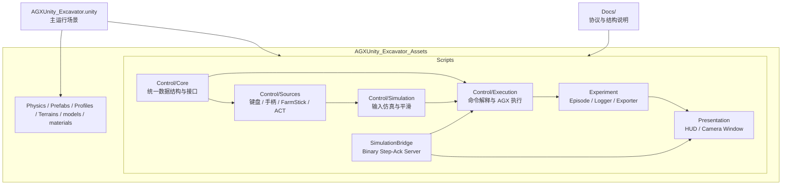
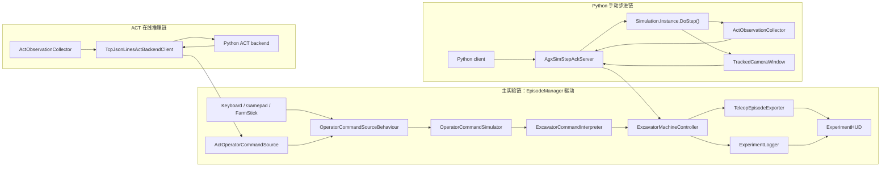

# AGXUnity Excavator Current Project Structure

更新时间：2026-03-19

## 1. 文档目的

这份文档描述的是 `AGXUnity_Excavator` 当前已经落地的项目结构，而不是早期设计草稿。

它回答三个问题：

- 代码现在按什么目录和模块组织
- 主场景里真实在运行的两条控制链路是什么
- 哪些文档应当被视为“现状真值源”

## 2. 适用范围与真值源

当前活跃集成目标是：

- `AGXUnity_Excavator.unity`

当前不作为主线说明对象的是：

- `AGXUnity_Excavator_measurements.unity`

与当前实现最接近的真值源是：

- `Docs/protocol.md`
- `AGXUnity_Excavator_Assets/Scripts/...`
- `AGXUnity_Excavator.unity`

需要特别说明：

- `Docs/excavator_act_software_structure.md` 更偏设计稿和演进思路，不应再被当成当前实现的精确结构说明。
- 本文档优先描述“现在代码里有什么、是怎么连起来的”。

## 3. 顶层目录

```text
AGXUnity_Excavator/
  AGXUnity_Excavator.unity
  AGXUnity_Excavator_measurements.unity
  AGXUnity_Excavator_Assets/
    Physics/
    Prefabs/
    Profiles/
    Scripts/
      Control/
      Experiment/
      Presentation/
      SimulationBridge/
      Editor/
    Terrains/
    materials/
    models/
  Docs/
  README.md
```

这里真正承载当前控制与实验逻辑的是：

- `AGXUnity_Excavator.unity`
- `AGXUnity_Excavator_Assets/Scripts/`
- `Docs/`

### 3.1 整体结构图

下面这张图描述的是当前项目的高层组织关系：



这张图对应的是“目录和模块如何拼起来”，不是运行时逐帧调用顺序。

## 4. Scripts 目录结构

### 4.1 `Control/Core`

这一层放统一的数据结构和抽象接口，是所有输入源和执行层共享的基础。

当前关键文件：

- `OperatorCommand.cs`
  统一的人类操作命令结构
- `IOperatorCommandSource.cs`
  输入源接口
- `OperatorCommandSourceBehaviour.cs`
  Unity 组件化输入源基类
- `ExcavatorActuationCommand.cs`
  挖机执行命令结构
- `ExcavatorRigLocator.cs`
  当前 rig 上组件解析辅助

### 4.2 `Control/Sources`

这一层负责“命令从哪里来”。

当前已经存在的来源包括：

- `KeyboardOperatorCommandSource.cs`
- `GamepadOperatorCommandSource.cs`
- `FarmStickOperatorCommandSource.cs`
- `ActOperatorCommandSource.cs`

同时这里也放了 ACT 相关协议和客户端组件：

- `ActBackendClientBehaviour.cs`
- `TcpJsonLinesActBackendClient.cs`
- `ActProtocol.cs`
- `ActObservationCollector.cs`

职责边界是：

- 输入源负责读取设备或后端结果
- 输出统一 `OperatorCommand`
- 不直接控制 AGX 约束

### 4.3 `Control/Simulation`

这一层负责把原始输入变成更平滑、更接近真实操作行为的控制量。

当前文件：

- `OperatorCommandSimulator.cs`
- `AxisResponseProfile.cs`

它位于输入源和机器解释层之间。

### 4.4 `Control/Execution`

这一层负责把 `OperatorCommand` 变成真正的挖机执行量，并写入 AGX 约束控制器。

当前关键文件：

- `ExcavatorCommandInterpreter.cs`
- `ExcavatorMachineController.cs`
- `ExcavatorActuationLimits.cs`

职责划分是：

- `Interpreter` 负责语义映射
- `MachineController` 负责实际执行和限幅
- `ActuationLimits` 提供加速度等约束参数

### 4.5 `Experiment`

这一层负责实验生命周期、日志和数据导出。

当前文件：

- `EpisodeManager.cs`
- `SceneResetService.cs`
- `ExperimentLogger.cs`
- `TeleopEpisodeExporter.cs`

职责划分：

- `EpisodeManager`
  负责回合开始、结束、重置、输入源切换，以及主控制链驱动
- `SceneResetService`
  负责场景重置
- `ExperimentLogger`
  负责导出逐帧 CSV 日志
- `TeleopEpisodeExporter`
  负责导出 teleop 数据目录，包含 `metadata.json`、`steps.jsonl` 和可选 FPV 原始帧

### 4.6 `Presentation`

这一层负责调试和可视化。

当前文件：

- `ExperimentHUD.cs`
- `TrackedCameraWindow.cs`

职责：

- `ExperimentHUD` 展示运行时状态、输入源、ACT 状态、step-ack 状态、导出路径
- `TrackedCameraWindow` 提供场景内相机窗口和原始 RGB 抓帧能力

### 4.7 `SimulationBridge`

这一层负责 Unity 与 Python 之间的二进制 step-ack 仿真桥。

当前文件：

- `AgxSimProtocol.cs`
- `AgxSimStepAckServer.cs`

职责：

- `AgxSimProtocol` 定义消息类型、常量和二进制 framing/CRC 语义
- `AgxSimStepAckServer` 对外提供 `GET_INFO / RESET / STEP` 服务，并在手动步进模式下调用 `Simulation.Instance.DoStep()`

## 5. 当前两条主运行链路

### 5.0 运行链路总图

下面这张图描述的是主场景里当前最重要的两条运行链路，以及它们之间的边界：



这张图强调的是：

- ACT 链最终仍然回到 `OperatorCommand` 主控制链
- step-ack 链直接驱动 `DoStep()`，不经过 `TcpJsonLinesActBackendClient`
- 两条链都能和 Python 通信，但职责不同

### 5.1 实验/交互控制链

这是主场景中 `EpisodeManager` 驱动的标准实验链。

```text
OperatorCommandSourceBehaviour
  -> OperatorCommandSimulator
  -> ExcavatorCommandInterpreter
  -> ExcavatorMachineController
  -> ExperimentLogger / TeleopEpisodeExporter
  -> ExperimentHUD
```

这条链支持：

- 键盘输入
- 手柄输入
- FarmStick 输入
- ACT 后端返回的 `OperatorCommand`

`EpisodeManager` 在 `Update()` 中完成如下工作：

1. 读取当前输入源的 `OperatorCommand`
2. 处理开始、停止、重置请求
3. 通过 `OperatorCommandSimulator` 做输入仿真
4. 通过 `ExcavatorCommandInterpreter` 转成执行命令
5. 通过 `ExcavatorMachineController` 应用到 AGX 挖机
6. 在回合运行时记录 CSV 日志和 teleop 导出

### 5.2 ACT 在线推理链

ACT 并不是直接替代 AGX 执行器，而是作为一种 `OperatorCommand` 来源插入到上面的主控制链中。

```text
ActObservationCollector
  -> TcpJsonLinesActBackendClient
  -> ActOperatorCommandSource
  -> EpisodeManager 主链
```

当前行为是：

- `ActObservationCollector` 从场景采集 ACT 观测
- `TcpJsonLinesActBackendClient` 用 TCP JSON Lines 与 Python ACT backend 通信
- `ActOperatorCommandSource` 管理 episode、`session_id`、`seq`、超时回零、非法响应过滤
- 产出的仍然是统一 `OperatorCommand`

所以 ACT 链是“决策输入源”，不是“外部手动步进器”。

### 5.3 Python 手动步进链

这是与 ACT 链平行的另一条接口，目标是让 Python 显式驱动 Unity 仿真一步一步前进。

```text
Python client
  -> AgxSimStepAckServer
  -> ApplyActuationCommand
  -> Simulation.Instance.DoStep()
  -> ActObservationCollector / TrackedCameraWindow
  -> STEP_RESP
```

当前这条链的关键特征：

- 使用二进制协议，不走 JSON Lines ACT 接口
- `RESET` 和 `STEP` 前会确保 `Simulation.AutoSteppingMode = Disabled`
- `STEP_REQ` 会应用 4 维 action，然后调用一次 `DoStep()`
- `STEP_RESP` 返回 4D `qpos`、4D `qvel`、`env_state`、`reward`、`sim_time_ns` 和 FPV 原始图像
- server 在 serving 时可以暂时禁用 `EpisodeManager`，避免常规实验链和手动步进同时驱动仿真

## 6. 主场景中的当前集成角色

`AGXUnity_Excavator.unity` 中当前主实验 rig 名称是：

- `ExcavatorExperimentRig`

这个 rig 当前承载的核心组件包括：

- `EpisodeManager`
- `OperatorCommandSimulator`
- `ExcavatorMachineController`
- `ExperimentLogger`
- `TeleopEpisodeExporter`
- `ExperimentHUD`
- `ActObservationCollector`
- `ActOperatorCommandSource`
- `TcpJsonLinesActBackendClient`
- `AgxSimStepAckServer`

可以把它理解成一个“实验控制中枢”：

- 交互式实验走 `EpisodeManager`
- ACT 在线推理也接在 `EpisodeManager` 上
- Python 手动步进走 `AgxSimStepAckServer`

## 7. 当前数据输出

当前项目已经有两类主要输出：

### 7.1 CSV 实验日志

默认目录：

- `ExperimentLogs/`

由 `ExperimentLogger` 负责，当前会记录：

- 原始操作命令
- 仿真后的操作命令
- 执行命令
- bucket 位姿
- 任务质量统计
- 硬件输入快照
- ACT 诊断字段

### 7.2 Teleop 回合导出

默认目录：

- `TeleopExports/`

由 `TeleopEpisodeExporter` 负责，当前目录结构是：

```text
episode_xxx_timestamp_source/
  metadata.json
  steps.jsonl
  frames/
    fpv/
      frame_000000.rgb24
      ...
```

这套导出更接近后续 Python 侧数据转换入口，而不是单纯调试日志。

## 8. 当前结构上的关键区分

当前项目最容易混淆的地方有两个：

### 8.1 ACT 链和 step-ack 链不是同一件事

- ACT 链是 Unity 主循环里按观测频率向 Python 请求操作命令
- step-ack 链是 Python 直接要求 Unity 执行一步仿真并返回结果

两者都连接 Python，但职责不同。

### 8.2 旧设计文档和当前实现不应混读

如果某个早期文档写的是“建议结构”或“计划类名”，而当前代码里没有对应类，那么应以当前代码和本文档为准。

## 9. 建议阅读顺序

如果要快速理解当前项目，建议按这个顺序读：

1. `Docs/protocol.md`
2. `AGXUnity_Excavator_Assets/Scripts/Experiment/EpisodeManager.cs`
3. `AGXUnity_Excavator_Assets/Scripts/Control/Sources/ActOperatorCommandSource.cs`
4. `AGXUnity_Excavator_Assets/Scripts/SimulationBridge/AgxSimStepAckServer.cs`
5. `AGXUnity_Excavator_Assets/Scripts/Experiment/TeleopEpisodeExporter.cs`
6. `AGXUnity_Excavator_Assets/Scripts/Presentation/ExperimentHUD.cs`

## 10. 当前状态总结

就当前实现来说，项目已经形成了比较清晰的四层结构：

- 控制输入层
- 挖机执行层
- 实验记录层
- Python 仿真桥接层

其中最重要的现实结论是：

- 主实验链以 `EpisodeManager` 为中心
- ACT 已经是统一输入源的一部分
- Python 手动步进由 `AgxSimStepAckServer` 单独承担
- `protocol.md` 是二进制仿真桥的协议真值源

这就是当前 `AGXUnity_Excavator` 的实际项目结构。
