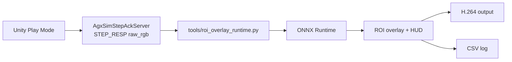

# ROI Detection Pipeline

Updated: 2026-04-08

## Scope

The runtime ROI path no longer runs inference inside Unity.

Unity now stops at:

1. `TrackedCameraWindow` renders the FPV camera.
2. `AgxSimStepAckServer` exports the post-step frame as `raw_rgb` inside `STEP_RESP`.
3. `RoiDetectionPipeline` either:
   - exports training labels in Unity, or
   - launches the external ROI sidecar when Play starts.

The external sidecar now handles:

1. decoding `STEP_RESP.image_payload`
2. ONNX Runtime inference
3. ROI box drawing
4. motion-intensity HUD
5. H.264 encoding
6. CSV logging

## Runtime Architecture

This keeps the protocol unchanged at `agx-sim/v0`.
We still ship `raw_rgb` from Unity, but ROI visualization and video encoding are now outside the editor process.

## Key Files

- `AGXUnity_Excavator_Assets/Scripts/ROIEnc/RoiDetectionPipeline.cs`
- `AGXUnity_Excavator_Assets/Scripts/ROIEnc/Training/DatasetWriter.cs`
- `AGXUnity_Excavator_Assets/Scripts/ROIEnc/Core/RoiExternalRuntimeLauncher.cs`
- `AGXUnity_Excavator_Assets/Scripts/SimulationBridge/AgxSimStepAckServer.cs`
- `tools/roi_dataset_tool.py`
- `tools/roi_eval.py`
- `tools/roi_train.py`
- `tools/roi_overlay_runtime.py`
- `tools/roi_runtime_config.yaml`
- `tools/run_roi_overlay_runtime.ps1`
- `_model_archive/roi_smoke_detector.onnx`

## Unity Modes

- `Disabled`
  - ROI helpers stay idle.
- `TrainingExport`
  - waits for `StepReq`
  - captures `rgb24`
  - writes `jpg + txt` YOLO samples into `ROI_Dataset`
  - writes `episode_XXXX_manifest.json` at episode end so the Python ingest tool can seal an HDF5 episode
- `ExternalOverlayRuntime`
  - keeps Unity on raw frame export only
  - auto-launches the external sidecar by default
  - shows runtime status through `RoiOverlayVisualizer`
- `ManualExport`
  - keeps the existing dataset capture workflow

## External Sidecar Contract

`tools/roi_overlay_runtime.py` expects:

- `STEP_RESP.image_format = "raw_rgb"`
- `image_payload = width * height * 3`
- top-to-bottom row order
- RGB channel order

The ONNX output contract stays compatible with the previous C# parser:

- explicit detections: repeated `[x1, y1, x2, y2, score, class]`
- or YOLO-style candidate tensors

The parser in the sidecar mirrors the heuristics that previously lived in `OnnxRoiDetector`.

## Model Placement

Runtime models should live outside `Assets/` now.

Default smoke-test model:

- `_model_archive/roi_smoke_detector.onnx`

That avoids Unity trying to import `.onnx` assets after the Barracuda package was removed.

## Smoke Test

Use either:

- Unity component context menu: `InferenceBackendSmokeRunner -> Run External ROI Self Test`
- shell: `tools/run_roi_overlay_runtime.ps1 -SelfTest`

The self-test writes:

- `ExperimentLogs/roi_overlay_runtime/roi_overlay_runtime_selftest.h264`
- `ExperimentLogs/roi_overlay_runtime/roi_overlay_runtime_selftest.csv`

## One-Click Runtime Test

1. Open `AGXUnity_Excavator.unity`.
2. Ensure `RoiDetectRig -> RoiDetectionPipeline` is in `ExternalOverlayRuntime`.
3. Press Play.

By default the sidecar starts automatically and writes:

- `ExperimentLogs/roi_overlay_runtime/roi_overlay_runtime.h264`
- `ExperimentLogs/roi_overlay_runtime/roi_overlay_runtime.csv`

The preview window can be closed with `Esc` or `q`.

## Current Limitations

- Unity no longer renders ROI boxes into the game view; overlay lives in the external preview/output stream.
- The shipped smoke model is only for pipeline validation; replace `_model_archive/roi_smoke_detector.onnx` with the trained detector when ready.
- Auxiliary kinematic fallback is still present in C# helpers, but it is not wired into the external sidecar yet.
- The raw `ROI_Dataset/` directory is only the collection staging area; long-term dataset management now belongs to `ROI_HDF5/` plus the new Python pipeline tools.
